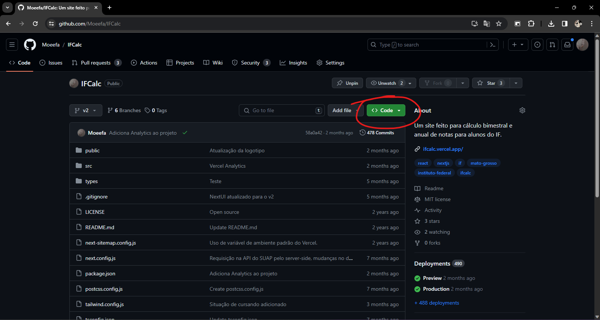

# ⏱️ Cápsula do Tempo
Esse é um programa bem simples feito em Python, cujo encripta/desencripta arquivos dentro do seu diretório em uma data específica.

## Antes de rodar o programa:
- Todos os arquivos encriptados **devem** estar na pasta "files" dentro do projeto, caso contrário, não irá funcionar.
- O arquivo do programa **deve** estar na pasta "src" do projeto.

## Como rodar o script no Windows:
- Baixe o projeto, para fazer isso, basta clicar no botão "Code" em cima.

- Em seguida, clique em "Download ZIP" nas opções e extraia os arquivos em uma pasta.
- Instale a linguagem Python (https://www.python.org/downloads/), o programa foi feito na versão 3.12.1, durante a instalação marque a caixa "Add python.exe to PATH" e em seguida clique em "Install Now".
- Abra o arquivo "decrypt.pyc" na pasta "src", ele tentará fazer os passos seguintes automaticamente.

<video style="border-radius:8px"><source src="./assets/Tutorial.mp4"/></video>

## Como rodar o script no Android:
Esse método é mais complicado, porém não impossível.
- Baixe o projeto, para fazer isso, basta clicar no botão "Code" em cima.
- Em seguida, clique em "Download ZIP" nas opções e extraia os arquivos em uma pasta.
- Instale o aplicativo Termux através do GitHub (https://github.com/termux/termux-app/releases), não utilize a Google Play Store pois é descontinuado o aplicativo por meio dela.
- Ao abrir o aplicativo, rode o comando: ``pkg install python
`` (o programa foi feito na versão 3.12.1)
  - Se aparecer uma mensagem se deseja continuar, vai ter duas opções "(y/n)", para continuar basta digitar "y" e apertar Enter.

A partir daqui os passos são parecidos com o do Windows.
- Para rodar o código, basta executar o seguinte comando: ``python src/decrypt.pyc``.
  - Se não funcionar, tente por: ``python decrypt.pyc``.

## Problemas ao rodar:
- **Python não foi reconhecido como um comando**: Abra o arquivo de instalação do Python novamente e clique em "Modify" para modificar a instalação, certifique-se de que a opção "Add Python to environment variables" está marcada.
- **Não foi possível desencriptar o(s) arquivo(s)**: Provavelmente algum arquivo contido na pasta já está desencriptado, se não for o caso, algum arquivo está corrompido. Certifique-se de que somente o arquivo da cápsula do tempo e os do projeto estão na pasta.
  - Se nada disso funcionar, arraste os arquivos da pasta "src" para a pasta de fora dele e tente novamente.
- **Data incorreta**: O arquivo só irá ser aberto após 10 anos (a partir de 31 de dezembro de 2023 UTC), rodar o código antes gerará essa mensagem.
- **Não foi possível instalar as dependências**: Para tentar resolver o problema siga os seguintes passos.
  - Abra essa pasta através do terminal (clique com o botão direito segurando shift na pasta principal do projeto, e clique em "Abrir no Terminal").
  - Rode o comando: ``pip install urllib3 requests cryptography``
  - Após a instalação das dependências, ainda no terminal, digite: ``python src/decrypt.pyc`` ou se não funcionar, tente por: ``python decrypt.pyc``.